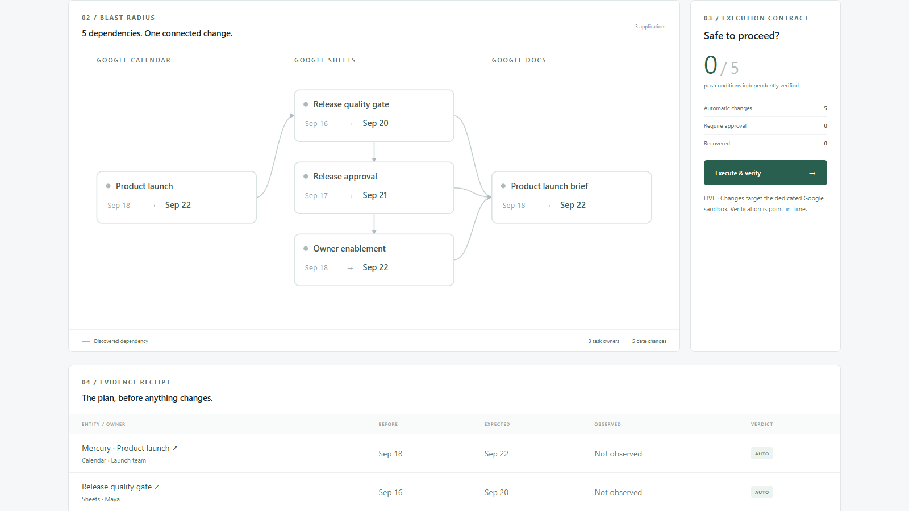
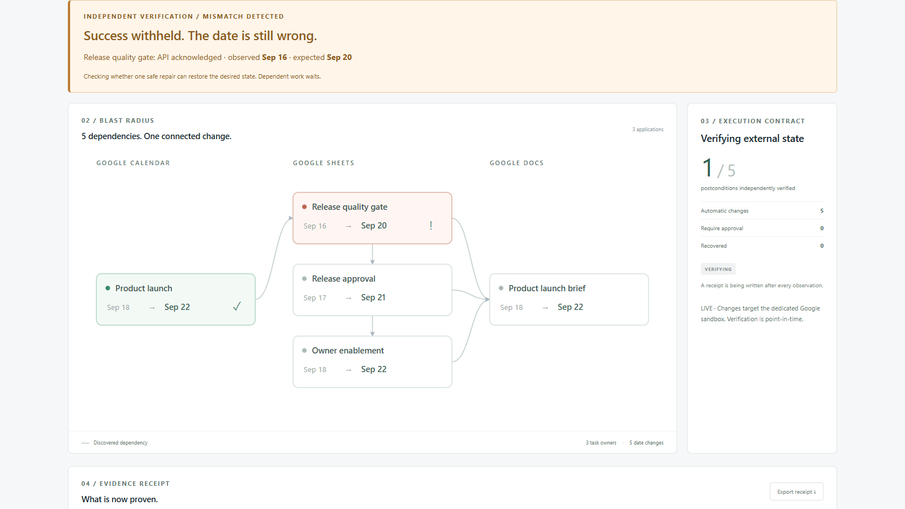
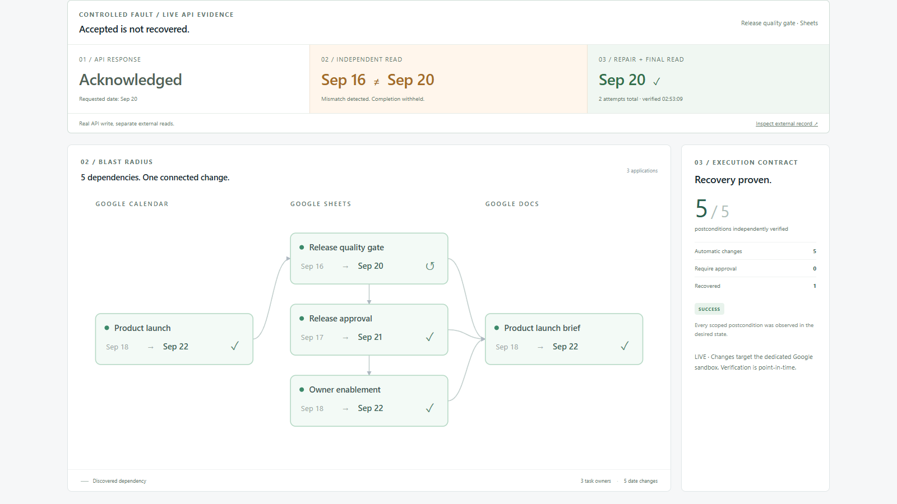
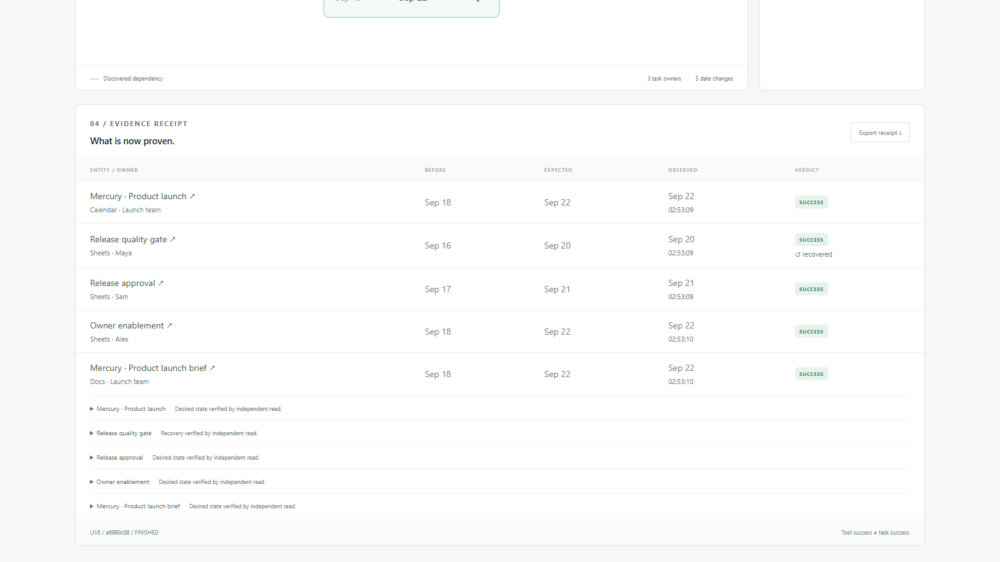
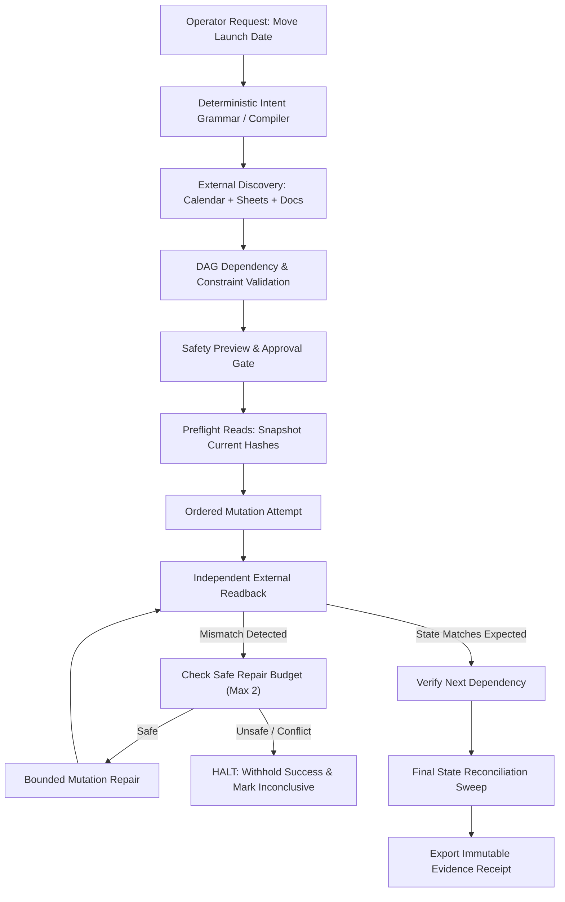

# Mercury — Cross-App Recovery Agent

> **"A change in one application is only done when its downstream impact across all connected systems is repaired and independently proven."**

[](#automated-verification)
[](#adversarial-reliability-suite)
[](#three-real-applications)
[-orange)](#two-minute-demo)
[](#license)

Mercury is an autonomous multi-app recovery agent designed to solve a fatal blind spot in modern AI agents: **Tool Call Optimism**. 

When an agent changes data in one application, relying on API HTTP 200 responses is not proof that the external world updated. Stale writes, conflicting concurrent edits, rate limits, and prerequisite cascades quietly leave organizations running on desynchronized, corrupted state.

Mercury traces consequential changes across **Google Calendar**, **Google Sheets**, and **Google Docs**, models the prerequisite graph, executes guarded writes, catches acknowledged-but-unapplied mutations via independent readbacks, performs bounded repairs, and produces cryptographic **evidence receipts**.

---

## Two-Minute Demo

- 📺 **[Watch Full Video on Google Drive (1080p, 1:57)](https://drive.google.com/file/d/1KVzqBSVnjKN5MVp1oClXB7tU69X0A0e7/view?usp=sharing)**
- 📁 **[Download / Inspect In-Repo MP4](demo/mercury-demo.mp4)** (`1920×1080 @ 30fps`, synchronized local audio + subtitles)
- 📊 **[Production Render Report](demo/render-report.json)** | **[Demo Script & Shot List](demo/SCRIPT.md)**

### Timeline & Key Beats
| Time | Phase | What Happens | Proof Captured |
|---|---|---|---|
| **0:00 – 0:13** | **The Problem** | Operator inputs launch date change: `Move launch from 2026-09-18 to 2026-09-22`. | Pain established before automation. |
| **0:13 – 0:37** | **Discovery** | Mercury inspects Google Calendar, extracts sandbox links, and reads Sheets register and Docs brief. Discovers 5 dependencies, 3 task owners, and prerequisite offsets. | [take-2-impact.png](demo/evidence/take-2-impact.png) |
| **0:37 – 0:43** | **Guarded Execution** | Preflight checks verify state before mutations. Calendar updates with etag concurrency control. | Writes separated from reads. |
| **0:43.5** | **Live Mismatch Detected** | Controlled fault: Google Sheets API acknowledges write, but independent readback catches that the date is still `Sep 16` instead of `Sep 20`. **Success is withheld.** | [take-2-failure.png](demo/evidence/take-2-failure.png) |
| **1:02.5** | **Safe Bounded Repair** | Mercury halts downstream dependent tasks (Docs brief), executes a scoped repair, and independently verifies `Sep 20`. Only then do dependent writes proceed. | [take-2-proof.png](demo/evidence/take-2-proof.png) |
| **1:29 – 1:57** | **Immutable Receipt** | Final state reconciled: 5 verified postconditions, timestamps, version digests, external URLs. Refuses false claims. | [take-2-receipt.png](demo/evidence/take-2-receipt.png) |

---

## Visual Proof & Evidence

### 1. Dynamic Blast Radius & Dependency Modeling
*Mercury discovers entities and prerequisites dynamically from external systems, rather than assuming a hardcoded action checklist.*



---

### 2. Independent Verification & Mismatch Detection
*An API return value is not evidence of desired external state. Mercury detects when an acknowledged write left stale data in Google Sheets, withholding false completion.*



---

### 3. The Recovery Proof Strip
*Visual demonstration of the 3-step proof: (1) API acknowledged, (2) Independent read discovers discrepancy, (3) Safe repair confirms desired state.*



---

### 4. Verified Immutable Evidence Receipt
*Every completed run produces a machine-readable, exportable receipt documenting external IDs, version digests, and exact readback timestamps.*



---

## Core Differentiators: What Makes Mercury Reliable

| Typical Multi-App Agents | Mercury Recovery Agent |
|---|---|
| **Optimistic Tool Execution:** Assumes tool return / HTTP 200 = task success. | **Pessimistic Verification:** Requires independent external readback before asserting postcondition state. |
| **Blind Retries:** Hammers failed APIs with identical payloads, causing duplicate writes. | **Preflighted Bounded Repair:** Re-reads before retrying; aborts if concurrent human edits occurred (max 2 attempts). |
| **Cascading Failures:** Propagates invalid state to downstream documents and stakeholders. | **Prerequisite Halting:** Holds downstream writes (e.g. Docs brief) until prerequisite tasks independently verify. |
| **Inflated Success Metrics:** Labels runs "SUCCESS" even if parts failed silently. | **Tri-State Verdicts:** `SUCCESS` (all proven), `FAILED` (confirmed conflict/rejection), or `INCONCLUSIVE` (unverifiable). |
| **Opaque Execution:** Black-box chain of thought that cannot be audited. | **Cryptographic Evidence Receipt:** Exact timestamps, etags, cell coordinates, and revision hashes. |

---

## Three Real Applications

Mercury does not use mock placeholders. It interfaces directly with documented REST APIs in a dedicated Google workspace:

1. **Google Calendar (`Calendar v3 API`):**
   - Anchors the root product launch milestone.
   - Employs HTTP `If-Match` with calendar `etags` to prevent race conditions.
   - Differentiates between internal events (auto-executable) and external guest events (requires operator approval).

2. **Google Sheets (`Sheets v4 API`):**
   - Manages the cross-functional launch dependency register (QA, Release Approval, Owner Enablement).
   - Enforces relative offset rules (e.g. QA must precede launch by -2 days).
   - Re-reads cell contents and row hashes before and after writes to guard against concurrent row edits.

3. **Google Docs (`Docs v1 API`):**
   - Maintains the executive launch operations brief.
   - Enforces structural tabs content parsing and exact string offset replacements with `requiredRevisionId`.
   - Strictly delayed until all prerequisite task gates in Google Sheets have verified.

---

## System Architecture



---

## Adversarial Reliability Suite

Mercury includes a comprehensive, deterministic evaluation harness testing the agent against edge cases and hostile conditions:

| Case | Injected Fault Scenario | Expected Verdict | Verified Behavior |
|:---:|---|:---:|---|
| **A** | **Happy Path:** Clean execution across 3 apps | `SUCCESS` | 5 writes, 5 independent readbacks, 0 retries. |
| **B** | **Permanent Mutation Rejection:** API rejects write | `FAILED` | Exactly 2 retry attempts; all downstream tasks halted. |
| **C** | **Acknowledged Stale Write:** API returns 200 but retains old date | `SUCCESS` | Mismatch detected; 1 repair executed; recovery proven. |
| **D** | **Concurrent Edit:** Intervening external edit detected | `FAILED` | Refuses to overwrite conflicting external data. |
| **E** | **Ambiguous Request:** Unsupported date grammar | `INCONCLUSIVE` | 0 mutations attempted; fails closed safely. |
| **F** | **Approval Gate:** External attendees on event | `INCONCLUSIVE` | Mutations blocked until operator explicit checkbox. |
| **F2**| **Explicit Approval:** Operator approves external changes | `SUCCESS` | External write verified; calendar updates sent. |
| **G** | **Unreadable Postcondition:** Readback API returns 500 | `INCONCLUSIVE` | Refuses to claim success without verifiable proof. |

---

## Running Locally

### Prerequisites
- **Node.js 24+**
- **Modern Browser** (Microsoft Edge or Google Chrome)

### 1. Install & Run in Rehearsal Mode (Zero Setup Needed)
Rehearsal mode exercises the full planner, dependency DAG, execution engine, and recovery UI using local stateful doubles:

```powershell
# Clone the repository
git clone https://github.com/aayushkumbharkar/mercury.git
cd mercury

# Install dependencies and start
npm ci
npm run build
npm start
```

Open **http://127.0.0.1:4317** in your browser. 
Try selecting different **Controlled Faults** (*Acknowledged stale write*, *Concurrent edit*, *Mutation rejected*) to see Mercury detect discrepancies and safely recover in real time.

---

### 2. Live Google Workspace Setup (Optional)
To run against real Google Calendar, Sheets, and Docs:

1. Create a Google Cloud Project and enable **Google Calendar API**, **Google Sheets API**, and **Google Docs API**.
2. Configure an **OAuth 2.0 Desktop Application** client and download the credentials JSON to:
   ```
   secrets/google-client.json
   ```
3. Authenticate and seed the dedicated test sandbox:
   ```powershell
   npm run auth     # Opens loopback browser sign-in
   npm run seed     # Provisions private demo calendar event, register sheet, and brief doc
   ```
4. Start the server and toggle mode to **Live · Google APIs**:
   ```powershell
   npm start
   ```

---

## Automated Verification

Mercury enforces strict quality gates across unit tests, production builds, and adversarial benchmarks:

```powershell
# Run 30 unit, contract, and adapter tests
npm test

# Run strict TypeScript typechecking and Vite production build
npm run build

# Run 8-case deterministic adversarial evaluation harness
npm run evaluate

# Run headless browser smoke test
npm run test:browser

# Run all verification suites in one command
npm run check
```

---

## Repository Structure

```
Mercury/
├── src/
│   ├── domain.ts        # Pure types: Entity, Plan, Action, Receipt, Result
│   ├── engine.ts        # Deterministic DAG planner, topological sort, executor
│   ├── google.ts        # Google Calendar, Sheets, Docs REST clients with etags
│   ├── auth.ts          # Desktop OAuth PKCE loopback authentication
│   ├── seed.ts          # Provisioner for isolated Google test sandbox
│   ├── rehearsal.ts     # State-holding doubles for offline testing & fault injection
│   └── server.ts        # Local server, API endpoints, execution lock
├── web/
│   ├── App.tsx          # Single-operator recovery workspace & live DAG viewer
│   ├── style.css        # Responsive, high-contrast dark/light design system
│   └── proof.ts         # Visual proof extractor for mismatches and repairs
├── tests/
│   ├── engine.test.ts   # Plan safety, prerequisite offset rules, cycle checks
│   ├── adapters.test.ts # Exact range replacements, cell coordinate boundaries
│   ├── google.test.ts   # Google API protocol, link validation, revision checks
│   ├── proof.test.ts    # Proof assertion honesty and recovery integrity
│   └── server.test.ts   # Execution deduplication and anti-CSRF protection
├── demo/
│   ├── mercury-demo.mp4 # 117s 1080p production demo video with audio & captions
│   ├── render-report.json # Exact timestamp log of live mismatch and recovery
│   ├── captions.srt     # Synchronized SRT subtitles
│   ├── record.mjs       # Playwright automated browser recorder
│   ├── render.mjs       # FFmpeg compositor (audio normalization & video scale)
│   └── evidence/        # Aligned screenshots and receipts from verified runs
├── ARCHITECTURE.md      # Detailed system and reliability brief
├── PRODUCT.md           # Product strategy and thesis
└── EVALUATION.md        # Formal reliability and evaluation contract
```

---

## License

MIT © [Aayush Kumbharkar](https://github.com/aayushkumbharkar)
